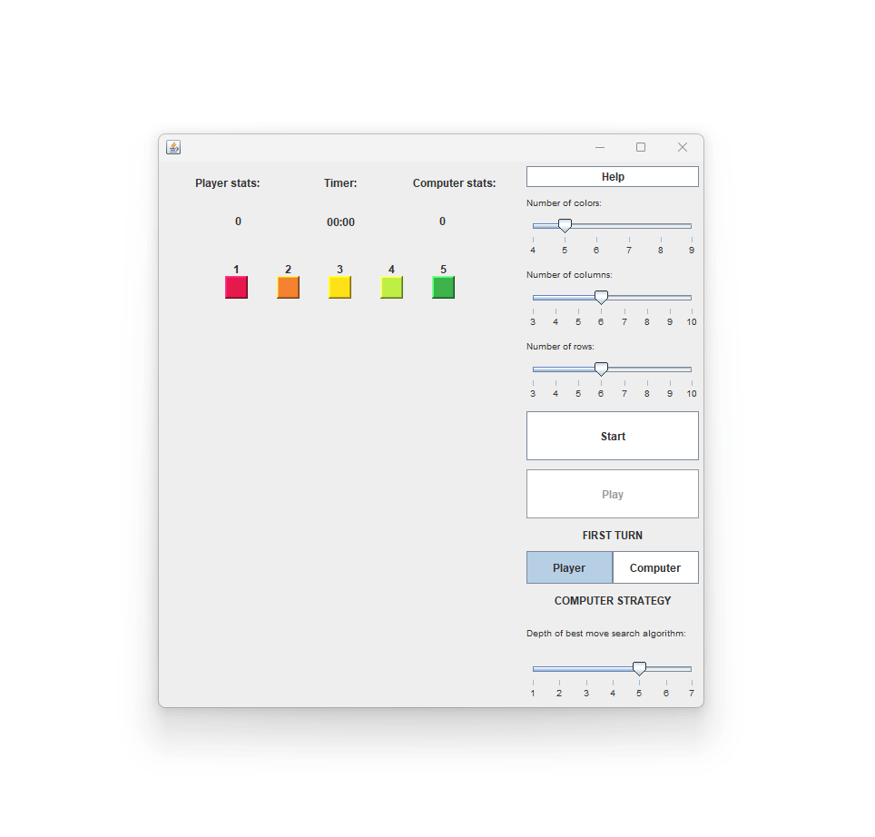

# Java Game Project

## Overview

This game is a strategic board game developed as part of the final university programming assignment. The game revolves around players altering the color of their game component on a two-dimensional board, aiming to outgrow the computer's component by the game's end.

## Features

- **AI using Improved Minimax Algorithm:**
  - Implemented an AI with an advanced minimax algorithm.
  - Alpha-beta pruning enhances computational efficiency by reducing the number of possibilities evaluated.
  - Possibilities are sorted based on the likelihood of success, optimizing decision-making.

- **Dynamic Game Board Generation:**
  - Customizable game board with adjustable parameters (colors, rows, and columns).
  - Ensured initial board conditions meet specific criteria for a fair and challenging game.

- **Multi-threaded Computer Logic:**
  - Computer's game logic runs in a separate thread, preventing delays during the computer's turn.
  - Threaded execution ensures a seamless gaming experience.

- **Project Organization and Best Practices:**
  - Organized project structure with distinct modules for UI, logic and game testing and analisys.
  - Well-commented code for easy navigation and maintenance.

## Getting Started

1. **Prerequisites:**
   - Java Development Kit (JDK)
   - IDE (Eclipse, IntelliJ, etc.)

2. **Clone the Repository:**
   ```bash
   git clone https://github.com/MykytaLein/pp23-game.git
   ```

3. **Run the Game:**
   - Open the project in your preferred IDE.
   - Locate the Start.java file in the start folder.
   - Run the game using the IDE's execution or build tools.

4. **Configuration:**
   - Adjust game settings in the user interface, including colors, rows, and columns.

## Example


## Contributing

If you'd like to contribute, please fork the repository and create a new branch. Pull requests are warmly welcome.